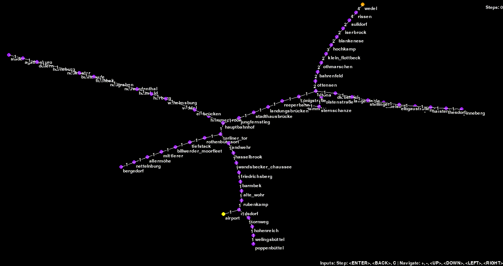
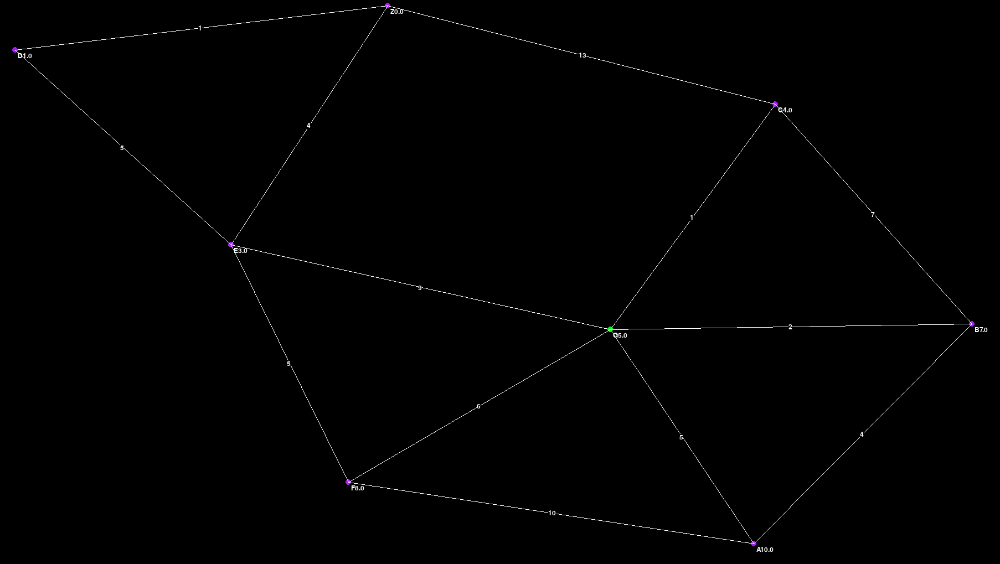

<!-- omit in toc -->
# Simulation of Dijkstra or A*
This is a implementation of Dijkstra and A* in pygame.


- [Installation](#installation)
- [Keymapping](#keymapping)
  - [Selection screen](#selection-screen)
  - [Navigation](#navigation)
- [Graph language](#graph-language)
  - [Minimal Example](#minimal-example)
  - [Syntax](#syntax)
- [More options](#more-options)
  - [Directed graphs](#directed-graphs)
  - [Heuristics](#heuristics)
  - [Subdirectories](#subdirectories)
- [Example](#example)
- [References](#references)


## Installation
- Install Python 3.11
- (Optional) Create a venv using `python -m venv .venv`
- Install Poetry using `pip install poetry`
- Install game using `poetry install` in the root of this repository
- You can now use `poetry run grasim -d saves` to start using preconfigured saves

## Keymapping
### Selection screen
| Keys          | Describtion                                                                                     |
| ------------- | ----------------------------------------------------------------------------------------------- |
|               |                                                                                                 |
| `<up>`/`<down>` | to select the graph                                                                             |
| `<Enter>`     | to load the selected graph                                                                      |
| `<Return>`    | to go back to the title screen, this is useful if you want to reload the graph selection screen |
| `D`           | To toggle between Dijkstra and A*                                                               |

### Navigation
| Keys                               | Describtion          |
| ---------------------------------- | -------------------- |
| `<Return>`                         | go back              |
| `<Enter>`                          | choose or continue   |
| `+` / `-`                          | zoom in / out graph  |
| `<left>`/`<right>`/`<up>`/`<down>` | move around in graph |


## Graph language
Safefiles are loaded when they are in the `saves/` (by default) folder and end with `.graph`

The directory where to look for `.graph` files can be changed via the commandline:
`grasim --diretory path-to-saves`

### Minimal Example
if you don't specify heuristics they 0
```
A -1- B

START A
END B
```

### Syntax
```
<NodeName>(<heuristic>)
<NodeName> -<length>- NodeB

START <NodeName>
END <NodeName>
# This line is a comment
```

## More options
### Directed graphs
Use `A -1-> B` for example to denote a path from A to B with a distance of 1.
```
<NodeName> <-<length>-> <NodeName>
```
### Heuristics
Use `A(1)` for example to denote that the estimated distance from A to the target is 1. 
The heuristic is 0 if you do not specify otherwise 

### Subdirectories
If you want to organize your graphs you can use subdirectories to group them. An example is provided.

## Example
Code for graph below
```
A(10)
B(7)
C(4)
E(3)
F(8)
G(5)
D(1)
Z(0)

A -4- B
A -10- F
A -5- G

B -7- C
B -2- G

F -6- G
F -5- E

G -1- C
G -9- E

C -13- Z

E -4- Z
E -5- D

D -1- Z

START G
END Z
```


## References
- This project uses [python-igraph](https://github.com/igraph/python-igraph) to layout the graphs
- Thanks to [Sebastion Iwanowski](https://www.fh-wedel.de/wir/organisation/team/detail/profil/profile/show/Sebastian-Iwanowski/) for feedback and support. A* and Dijkstra are part of his [Application of AI](https://intern.fh-wedel.de/mitarbeiter/iw/eng/lv/aki/) class. 